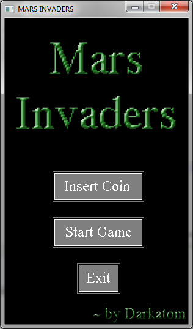
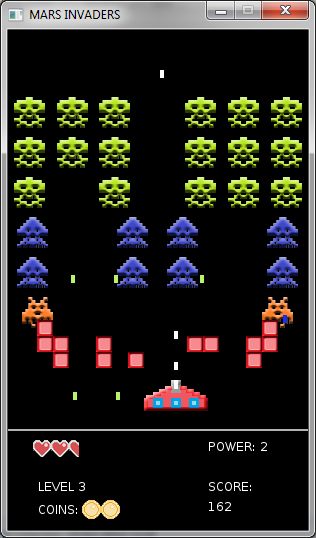

Lua_Mars-Invaders
=============
Mars Invaders game was programmed with Lua and LÖVE2D 0.8.0 library following the iterative development model.
I programmed it with the intention of teaching others how to program in Lua and LÖVE2D while having fun with it.

<i>NOTE: The game is finished as of now, being Iteration 6 the one to hold the finished program.</i>

Controls
-----------------------------------------------------
Left Arrow - a: Move player to the left 
Right Arrow - d: Move it to the right  
Return - z: Shoot 

How to use it
-----------------------------------------------------
Each iteration holds the code for what was developed during that iteration. This means, each one of them holds a copy of the game during various stages. As of now, the game is finished. You can find it completed inside the "Iteration 6" folder.

The only thing you need is [LÖVE2D](http://love2d.org/). Just download the v.0.8.0 and follow the steps.
To execute it, click and drag the root folder of the game to the LÖVE2D.exe icon. If this does not work, check [LÖVE2D webpage](http://love2d.org/) for other methods.
<i>NOTE: Newer versions might not work properly for this game.</i>

License
-----------------------------------------------------
"Space Invaders" was originally developed by Taito Corporation and designed by Toshihiro Nishikado. No copyright or IP infringement intended. The code in this redo is subjected to the LPGL v3 license.
